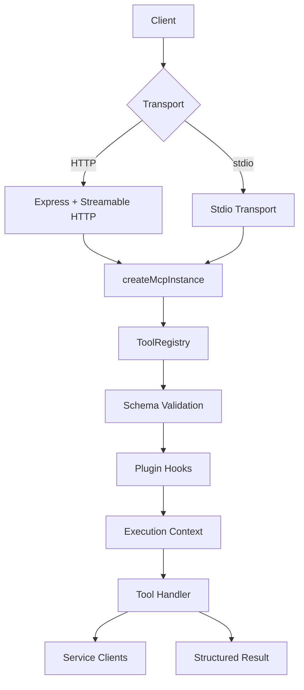
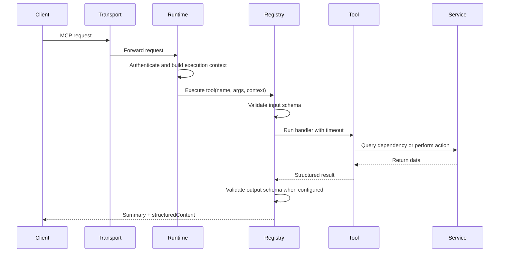

# MCP Server Scaffolding

<!-- markdownlint-disable MD033 -->

Production-oriented Model Context Protocol server scaffolding for TypeScript. This repository gives you a working starting point for building MCP servers that need more than a bare transport layer. It already includes transport bootstrapping, tool registration, schema validation, execution timeouts, context resolution, plugin hooks, logging, authentication hooks, and a test harness.

The goal of this project is not only to expose tools to an MCP client, but to do it in a way that remains understandable when the server grows. A real MCP server usually has to answer three questions at once: what tools exist, what inputs are valid, and what context should be injected before those tools run. This scaffold separates those concerns so new tools can be added without reworking the runtime.

> [!IMPORTANT]
> This repository is a scaffold, not a finished product. The runtime, transports, schemas, and tool registry are real, but the service clients are intentionally lightweight examples that you are expected to adapt to your own systems and trust boundaries.

## Table Of Contents

- [What This Project Is](#what-this-project-is)
- [Why This Scaffold Exists](#why-this-scaffold-exists)
- [Feature Snapshot](#feature-snapshot)
- [Tech Stack](#tech-stack)
- [Architecture](#architecture)
- [Repository Layout](#repository-layout)
- [How The Runtime Works](#how-the-runtime-works)
- [Getting Started](#getting-started)
- [Configuration](#configuration)
- [Included Tools](#included-tools)
- [Extension Model](#extension-model)
- [Testing](#testing)
- [Operational Guidance](#operational-guidance)

## What This Project Is

This repository is a TypeScript MCP server that can run over either Streamable HTTP or stdio. The runtime is created in `src/server.ts`, started from `src/index.ts`, and configured through environment variables read by `src/config/serverConfig.ts`. The server builds a set of tool definitions, wraps them in a registry, validates inputs and outputs with JSON schema, and then exposes them to an MCP client through the official `@modelcontextprotocol/sdk`.

In practice, that means you can use this repository as a base when you need a server that supports structured tool inputs, context-aware execution, integration stubs, and predictable operational behavior. It is useful when you want to avoid writing the same transport, auth, validation, and logging code for every new MCP service.

## Why This Scaffold Exists

Small MCP demos are easy to write, but they often become difficult to maintain once you introduce multiple tools, external services, and different execution environments. This scaffold exists to solve that exact transition. It separates the transport layer from the tool layer, keeps schemas explicit, and gives each request a consistent execution context so that authentication, mission state, and logging can be handled in one place.

That structure matters because MCP servers usually sit between language models and operational systems. When a model is allowed to call a tool, you need to know what the tool does, how the arguments are validated, how long it is allowed to run, and how errors are surfaced back to the client. Those concerns are already wired here.

> [!NOTE]
> The scaffold defaults to HTTP transport when no environment override is present. The integration tests also assert that behavior, which makes the default visible in both the code and the test suite.

## Feature Snapshot

| <sub>#</sub> | <sub>Area</sub> | <sub>What It Does</sub> | <sub>Why It Matters</sub> |
| --- | --- | --- | --- |
| <sub>1</sub> | <sub>Transport modes</sub> | <sub>Runs over Streamable HTTP or stdio using the official MCP SDK.</sub> | <sub>Lets the same server support local development flows and remotely hosted clients.</sub> |
| <sub>2</sub> | <sub>Tool registry</sub> | <sub>Registers tool definitions once and executes them through a shared registry.</sub> | <sub>Keeps validation, plugins, and timeout handling consistent across every tool.</sub> |
| <sub>3</sub> | <sub>Schema validation</sub> | <sub>Validates tool inputs and optional outputs against JSON schema.</sub> | <sub>Prevents malformed requests from reaching tool logic and improves client interoperability.</sub> |
| <sub>4</sub> | <sub>Context providers</sub> | <sub>Builds system, user, and mission context for each execution.</sub> | <sub>Gives tools the runtime facts they need without hard-coding environment state into every handler.</sub> |
| <sub>5</sub> | <sub>Auth hooks</sub> | <sub>Supports API-key checks for HTTP requests and scope-aware execution metadata.</sub> | <sub>Creates a clear place to replace development auth with production identity controls.</sub> |
| <sub>6</sub> | <sub>Plugin lifecycle</sub> | <sub>Offers request start, success, and error hooks around tool execution.</sub> | <sub>Makes auditing, metrics, and policy enforcement easier to add later.</sub> |
| <sub>7</sub> | <sub>Timeout wrapper</sub> | <sub>Stops long-running tool execution after a configured limit.</sub> | <sub>Protects the server from stuck dependencies and preserves client responsiveness.</sub> |
| <sub>8</sub> | <sub>Testing</sub> | <sub>Includes Vitest coverage for context, tool registration, and integration behavior.</sub> | <sub>Gives you a starting verification layer before you add domain-specific code.</sub> |

Note: This table summarizes the runtime capabilities that already exist in the repository today, not aspirational roadmap items.

## Tech Stack

The stack is intentionally narrow. Each dependency supports a specific part of the server lifecycle, and there is very little framework overhead beyond the MCP SDK itself.

| <sub>#</sub> | <sub>Dependency</sub> | <sub>Role In This Repository</sub> | <sub>Why It Was Chosen</sub> |
| --- | --- | --- | --- |
| <sub>1</sub> | <sub>TypeScript</sub> | <sub>Implements the runtime, tool contracts, and context types.</sub> | <sub>Provides type safety across request handling, service wiring, and tool execution.</sub> |
| <sub>2</sub> | <sub>@modelcontextprotocol/sdk</sub> | <sub>Supplies the MCP server primitives, stdio transport, and Streamable HTTP transport.</sub> | <sub>It is the canonical SDK for implementing standards-aligned MCP servers.</sub> |
| <sub>3</sub> | <sub>Express</sub> | <sub>Hosts the HTTP transport endpoints and health route.</sub> | <sub>It keeps the HTTP side simple and readable without hiding request flow.</sub> |
| <sub>4</sub> | <sub>Ajv</sub> | <sub>Validates JSON schemas for tool input and output envelopes.</sub> | <sub>It is fast, mature, and well suited for schema-first interfaces.</sub> |
| <sub>5</sub> | <sub>Zod</sub> | <sub>Defines runtime input shapes used when registering tools with the MCP SDK.</sub> | <sub>It keeps the tool registration surface ergonomic while JSON schema remains authoritative for validation.</sub> |
| <sub>6</sub> | <sub>dotenv</sub> | <sub>Loads environment variables during startup.</sub> | <sub>It makes local configuration predictable without custom bootstrapping code.</sub> |
| <sub>7</sub> | <sub>Vitest</sub> | <sub>Runs unit and integration tests.</sub> | <sub>It is fast enough for iterative work and straightforward for TypeScript projects.</sub> |
| <sub>8</sub> | <sub>tsx</sub> | <sub>Runs TypeScript directly during development.</sub> | <sub>It shortens the edit-run loop and avoids a manual build step while iterating.</sub> |

Note: This table explains the current production and development dependencies declared in `package.json` and how they map to the repository structure.

## Architecture

The runtime is centered around a single composition path. Configuration is loaded first, service clients are created from that configuration, tool definitions are built from those services, and a `ToolRegistry` executes them behind a uniform validation and plugin boundary. The transport layer sits outside that registry so HTTP and stdio can share the same execution model.



Note: This diagram shows the execution path from an MCP client to a tool result, including the layers that enforce validation and shared runtime behavior.

The most important architectural decision in this codebase is that tool code does not own transport setup, authentication parsing, or context assembly. Those concerns are handled in the runtime before a tool executes. That keeps tool handlers focused on domain work instead of protocol plumbing.

> [!TIP]
> If you plan to add many tools, keep following the current pattern: define schema first, create a thin tool wrapper second, and isolate remote API or database logic inside `src/services/`. That separation will scale much better than embedding service calls directly inside the transport layer.

## Repository Layout

The directory structure is organized around responsibilities rather than technology layers alone. Tools live separately from services because tools define the contract that clients see, while services handle the implementation details of talking to other systems. Context providers are also isolated because context is cross-cutting and should not be rebuilt independently inside every handler.

| <sub>#</sub> | <sub>Path</sub> | <sub>Purpose</sub> | <sub>Why It Exists</sub> |
| --- | --- | --- | --- |
| <sub>1</sub> | <sub>src/index.ts</sub> | <sub>Starts the runtime and exits cleanly on fatal startup errors.</sub> | <sub>Keeps process entry concerns separate from server composition.</sub> |
| <sub>2</sub> | <sub>src/server.ts</sub> | <sub>Builds services, registry, transports, and runtime startup flow.</sub> | <sub>Acts as the core composition root for the application.</sub> |
| <sub>3</sub> | <sub>src/config/</sub> | <sub>Loads and normalizes environment-driven server configuration.</sub> | <sub>Prevents configuration parsing from leaking into business logic.</sub> |
| <sub>4</sub> | <sub>src/context/</sub> | <sub>Resolves system, user, and mission context objects.</sub> | <sub>Gives tool execution a consistent context envelope.</sub> |
| <sub>5</sub> | <sub>src/tools/</sub> | <sub>Defines MCP-visible tools and their input shapes.</sub> | <sub>Creates a stable contract for model-facing interactions.</sub> |
| <sub>6</sub> | <sub>src/services/</sub> | <sub>Implements integration-facing client logic and logging.</sub> | <sub>Separates external system access from tool orchestration.</sub> |
| <sub>7</sub> | <sub>src/plugins/</sub> | <sub>Provides lifecycle extension points around execution.</sub> | <sub>Lets you add observability or policy hooks without changing every tool.</sub> |
| <sub>8</sub> | <sub>src/schemas/</sub> | <sub>Stores JSON schema documents for tool requests and shared types.</sub> | <sub>Keeps tool contracts explicit and reusable.</sub> |
| <sub>9</sub> | <sub>src/utils/</sub> | <sub>Holds auth, validation, timeout, and error helpers.</sub> | <sub>Centralizes infrastructure behavior that multiple slices depend on.</sub> |
| <sub>10</sub> | <sub>tests/</sub> | <sub>Verifies context behavior, tool registration, and integration defaults.</sub> | <sub>Documents expected behavior while protecting against regressions.</sub> |

Note: This table is a high-level guide to where responsibilities live so new contributors can add features without guessing where code belongs.

<details>
<summary>Expanded folder tree</summary>

```text
mcp-server/
├── package.json
├── README.md
├── tsconfig.json
├── src/
│   ├── index.ts
│   ├── server.ts
│   ├── config/
│   │   └── serverConfig.ts
│   ├── context/
│   │   ├── missionContext.ts
│   │   ├── systemContext.ts
│   │   └── userContext.ts
│   ├── plugins/
│   │   └── index.ts
│   ├── schemas/
│   │   ├── assuranceSchema.json
│   │   ├── commonTypes.json
│   │   ├── customToolSchema.json
│   │   ├── jiraSchema.json
│   │   └── searchSchema.json
│   ├── services/
│   │   ├── dbClient.ts
│   │   ├── jiraClient.ts
│   │   ├── loggingService.ts
│   │   └── nasaAssuranceClient.ts
│   ├── tools/
│   │   ├── customTool.ts
│   │   ├── index.ts
│   │   ├── jiraTool.ts
│   │   ├── nasaAssuranceTool.ts
│   │   └── searchTool.ts
│   ├── types/
│   │   ├── ContextTypes.ts
│   │   └── ToolTypes.ts
│   └── utils/
│       ├── auth.ts
│       ├── errorHandler.ts
│       └── schemaValidator.ts
└── tests/
    ├── contextTests.test.ts
    ├── integration.test.ts
    └── toolTests.test.ts
```

</details>

## How The Runtime Works

At startup, `createRuntime()` loads normalized configuration, creates service clients, loads built-in plugins, and builds the tool registry. From there, the runtime selects HTTP or stdio mode based on `MCP_TRANSPORT`. The result is one composition path with two transport adapters instead of two different servers that happen to expose similar tools.

When a request reaches a tool, the runtime authenticates it, resolves context, validates the input schema, runs plugin hooks, executes the tool with a timeout, optionally validates the output schema, and formats the result for the MCP client. This is the core reason the scaffold is useful: every tool benefits from the same safety and observability envelope.



Note: This sequence diagram shows the control flow that every tool invocation shares, regardless of which transport receives the request.

| <sub>#</sub> | <sub>Runtime Stage</sub> | <sub>What Happens</sub> | <sub>Operational Benefit</sub> |
| --- | --- | --- | --- |
| <sub>1</sub> | <sub>Configuration load</sub> | <sub>Environment variables are parsed into a typed config object.</sub> | <sub>Startup behavior stays deterministic across environments.</sub> |
| <sub>2</sub> | <sub>Service creation</sub> | <sub>Logger and integration clients are constructed once.</sub> | <sub>Prevents scattered initialization logic.</sub> |
| <sub>3</sub> | <sub>Tool definition assembly</sub> | <sub>Tools are created from shared services.</sub> | <sub>Encourages consistent dependency injection.</sub> |
| <sub>4</sub> | <sub>Request authentication</sub> | <sub>Headers and scopes are evaluated before execution.</sub> | <sub>Rejects unauthorized traffic early.</sub> |
| <sub>5</sub> | <sub>Context resolution</sub> | <sub>System, user, and mission facts are injected into the execution context.</sub> | <sub>Gives tools richer information without manual plumbing.</sub> |
| <sub>6</sub> | <sub>Validation and timeout</sub> | <sub>Input is validated and execution is bounded by time.</sub> | <sub>Improves safety and resilience under bad inputs or slow dependencies.</sub> |
| <sub>7</sub> | <sub>Lifecycle hooks</sub> | <sub>Plugins observe success and failure paths.</sub> | <sub>Supports auditing and metrics without rewriting handlers.</sub> |
| <sub>8</sub> | <sub>Structured response</sub> | <sub>The MCP client receives human-readable text and machine-readable content.</sub> | <sub>Helps both interactive use and downstream automation.</sub> |

Note: This table breaks the runtime into concrete stages so it is easier to reason about where to extend behavior and where to debug failures.

## Getting Started

You can run the server locally in either HTTP mode or stdio mode. HTTP is the default and is useful when you want a network-accessible MCP endpoint. stdio is useful when another process spawns this server directly and communicates over standard input and output.

```bash
npm install
npm run dev:http
```

That starts the server in HTTP mode using `tsx` for rapid iteration. The HTTP runtime exposes a health endpoint and the MCP endpoint handled by the official Streamable HTTP transport.

If you want the server to behave like a local subprocess tool host instead, run:

```bash
npm run dev:stdio
```

Once you are ready for a production-style build artifact, compile and run the emitted JavaScript:

```bash
npm run build
npm start
```

> [!TIP]
> Use HTTP mode during integration testing with remote clients and stdio mode when validating that a desktop client or local orchestrator can spawn the process directly.

## Configuration

Configuration is environment-driven, and `src/config/serverConfig.ts` is the single normalization point. That design is important because environment variables are messy in raw form. The config layer turns string values into booleans, numbers, sets, and transport enums before the rest of the application reads them.

Create a local environment file or export variables in your shell before starting the server. The defaults are intentionally development-friendly, especially for transport mode and network binding.

```bash
MCP_TRANSPORT=http
MCP_HOST=127.0.0.1
MCP_PORT=8080
MCP_EXECUTION_TIMEOUT_MS=15000
MCP_LOG_LEVEL=info
```

| <sub>#</sub> | <sub>Variable</sub> | <sub>Meaning</sub> | <sub>Default Behavior</sub> |
| --- | --- | --- | --- |
| <sub>1</sub> | <sub>MCP_SERVER_NAME</sub> | <sub>Logical server name advertised to clients.</sub> | <sub>Falls back to `mcp-server`.</sub> |
| <sub>2</sub> | <sub>MCP_SERVER_VERSION</sub> | <sub>Logical server version exposed by the runtime.</sub> | <sub>Falls back to `0.1.0`.</sub> |
| <sub>3</sub> | <sub>MCP_TRANSPORT</sub> | <sub>Selects `http` or `stdio` mode.</sub> | <sub>Defaults to HTTP unless explicitly set to `stdio`.</sub> |
| <sub>4</sub> | <sub>MCP_HOST</sub> | <sub>HTTP bind address.</sub> | <sub>Defaults to `127.0.0.1`.</sub> |
| <sub>5</sub> | <sub>MCP_PORT</sub> | <sub>HTTP bind port.</sub> | <sub>Defaults to `8080`.</sub> |
| <sub>6</sub> | <sub>MCP_CORS_ORIGINS</sub> | <sub>Controls allowed browser origins for HTTP mode.</sub> | <sub>`*` means any origin is allowed.</sub> |
| <sub>7</sub> | <sub>MCP_EXECUTION_TIMEOUT_MS</sub> | <sub>Caps tool execution time in milliseconds.</sub> | <sub>Defaults to `15000`.</sub> |
| <sub>8</sub> | <sub>MCP_LOG_LEVEL</sub> | <sub>Sets the logging verbosity.</sub> | <sub>Defaults to `info`.</sub> |

Note: This table covers server-level configuration that changes transport and operational behavior.

| <sub>#</sub> | <sub>Variable</sub> | <sub>Meaning</sub> | <sub>Default Behavior</sub> |
| --- | --- | --- | --- |
| <sub>1</sub> | <sub>MCP_AUTH_ENABLED</sub> | <sub>Turns HTTP API-key checks on or off.</sub> | <sub>Defaults to disabled.</sub> |
| <sub>2</sub> | <sub>MCP_API_KEY_HEADER</sub> | <sub>Defines the HTTP header used for API-key lookup.</sub> | <sub>Defaults to `x-mcp-api-key`.</sub> |
| <sub>3</sub> | <sub>MCP_API_KEYS</sub> | <sub>Comma-separated list of valid API keys.</sub> | <sub>Parses into an empty set when unset.</sub> |
| <sub>4</sub> | <sub>MISSION_ID</sub> | <sub>Mission identifier injected into context.</sub> | <sub>Defaults to `mission-sample`.</sub> |
| <sub>5</sub> | <sub>MISSION_NAME</sub> | <sub>Mission display name injected into context.</sub> | <sub>Defaults to `Mission Control Scaffold`.</sub> |
| <sub>6</sub> | <sub>MISSION_ENVIRONMENT</sub> | <sub>Mission environment value exposed to tools.</sub> | <sub>Falls back to `NODE_ENV` or `development`.</sub> |
| <sub>7</sub> | <sub>JIRA_BASE_URL / JIRA_TOKEN</sub> | <sub>Jira integration connection settings.</sub> | <sub>Remain undefined until you wire a real service.</sub> |
| <sub>8</sub> | <sub>NASA_ASSURANCE_BASE_URL / NASA_ASSURANCE_TOKEN</sub> | <sub>NASA assurance integration connection settings.</sub> | <sub>Remain undefined until you wire a real service.</sub> |

Note: This table covers authentication, mission context, and external integration wiring.

> [!WARNING]
> The included API-key pattern is suitable as a development hook or for tightly controlled internal use, but it should not be treated as the final security model for public or internet-facing deployments. Replace it with a stronger authorization flow before exposing this server broadly.

## Included Tools

The scaffold ships with four example tools so the registry, schemas, summaries, and service boundaries are visible immediately. Three are read-oriented examples and one is a write-capable placeholder. Together they demonstrate the difference between query-style tools and side-effecting actions.

| <sub>#</sub> | <sub>Tool Name</sub> | <sub>What It Does</sub> | <sub>Scope Pattern</sub> |
| --- | --- | --- | --- |
| <sub>1</sub> | <sub>jira_query</sub> | <sub>Searches Jira issues by query text with optional project and limit filters.</sub> | <sub>Requires `tools:read`.</sub> |
| <sub>2</sub> | <sub>nasa_assurance_lookup</sub> | <sub>Retrieves requirement assurance status and optional evidence details.</sub> | <sub>Requires `tools:read`.</sub> |
| <sub>3</sub> | <sub>search_knowledge</sub> | <sub>Searches indexed operational or assurance knowledge.</sub> | <sub>Requires `tools:read`.</sub> |
| <sub>4</sub> | <sub>custom_action</sub> | <sub>Acknowledges a domain-specific action payload and serves as the write example.</sub> | <sub>Requires `tools:write`.</sub> |

Note: This table maps directly to the tool names asserted by the integration tests, so it is a reliable snapshot of the tools currently registered by default.

```json
{
  "query": "thermal constraint",
  "projectKey": "OPS",
  "limit": 5
}
```

The important detail is not the sample data itself but the contract shape. Each tool has an input schema identifier, an MCP-facing input shape, a handler, and a summary function. That combination gives the client a usable interface while keeping validation and execution behavior explicit.

## Extension Model

The project is designed so that new capabilities are added as slices instead of as scattered edits. A new tool should normally involve a schema, a tool module, and optionally a service client. A new context provider should only change the context layer and runtime composition. A new plugin should hook into lifecycle events without changing the registry execution semantics.

| <sub>#</sub> | <sub>Extension Type</sub> | <sub>Where To Change Code</sub> | <sub>Typical Reason</sub> |
| --- | --- | --- | --- |
| <sub>1</sub> | <sub>New tool</sub> | <sub>`src/schemas/`, `src/tools/`, and `src/tools/index.ts`</sub> | <sub>Add a new MCP capability visible to clients.</sub> |
| <sub>2</sub> | <sub>New service</sub> | <sub>`src/services/` and `createServices()` in `src/server.ts`</sub> | <sub>Connect tools to a new API, database, or internal system.</sub> |
| <sub>3</sub> | <sub>New context provider</sub> | <sub>`src/context/` and `resolveContexts()` in `src/server.ts`</sub> | <sub>Inject more runtime state into tool execution.</sub> |
| <sub>4</sub> | <sub>New plugin</sub> | <sub>`src/plugins/` and `createRuntime()` wiring</sub> | <sub>Add metrics, auditing, tracing, or policy checks.</sub> |
| <sub>5</sub> | <sub>New schema type</sub> | <sub>`src/schemas/commonTypes.json` or a tool-specific schema file</sub> | <sub>Reuse structured contracts across multiple tools.</sub> |

Note: This table explains how to extend the scaffold without collapsing its separation between contracts, execution, and integrations.

<details>
<summary>Suggested workflow for adding a new tool</summary>

1. Add or update the JSON schema in `src/schemas/` so the contract is explicit first.
2. Create a tool module in `src/tools/` that declares name, title, scopes, input shape, and handler.
3. If the tool talks to an external system, place that logic in `src/services/` instead of the tool file.
4. Export the tool from `src/tools/index.ts` so the registry can include it.
5. Add or update tests in `tests/` so the registration and behavior remain visible.

</details>

## Testing

The test suite is intentionally small but useful. It verifies that the runtime comes up with the expected tool list and that HTTP remains the default transport unless configuration overrides it. That baseline matters because documentation and operational expectations often drift first around entrypoints and defaults.

```bash
npm test
```

| <sub>#</sub> | <sub>Test File</sub> | <sub>What It Covers</sub> | <sub>Why It Matters</sub> |
| --- | --- | --- | --- |
| <sub>1</sub> | <sub>tests/toolTests.test.ts</sub> | <sub>Tool-oriented behavior.</sub> | <sub>Keeps tool contracts and execution slices from regressing silently.</sub> |
| <sub>2</sub> | <sub>tests/contextTests.test.ts</sub> | <sub>Context provider behavior.</sub> | <sub>Protects the runtime facts injected into tools.</sub> |
| <sub>3</sub> | <sub>tests/integration.test.ts</sub> | <sub>Registry composition and default transport behavior.</sub> | <sub>Confirms the assembled runtime still matches its documented entry behavior.</sub> |

Note: This table highlights the current testing slices so contributors know where to extend coverage when they add new runtime behavior.

## Operational Guidance

When you move from scaffold to production use, focus first on integration realism and trust boundaries. The code already gives you a stable structure for validation, request handling, and lifecycle hooks, but production readiness depends on the service implementations, the authentication model, and the operational policies you add around them.

Keep the runtime contract narrow and explicit. Tool names should be stable, schemas should be versioned with care, and logs should remain structured enough to support debugging and audit needs. The registry pattern in this repository makes that discipline easier because it creates one place to enforce it.

> [!NOTE]
> A good production evolution path is usually: replace mock-like service behavior with real integrations, tighten auth, add tracing or audit plugins, and then expand the test suite around the new failure modes introduced by those external dependencies.

## Scripts

| <sub>#</sub> | <sub>Script</sub> | <sub>Command</sub> | <sub>Use Case</sub> |
| --- | --- | --- | --- |
| <sub>1</sub> | <sub>build</sub> | <sub>`tsc -p tsconfig.json`</sub> | <sub>Compile the project for a production-style run.</sub> |
| <sub>2</sub> | <sub>dev</sub> | <sub>`tsx watch src/index.ts`</sub> | <sub>General development entrypoint.</sub> |
| <sub>3</sub> | <sub>dev:http</sub> | <sub>`tsx watch src/index.ts`</sub> | <sub>Explicit HTTP development mode.</sub> |
| <sub>4</sub> | <sub>dev:stdio</sub> | <sub>`cross-env MCP_TRANSPORT=stdio tsx watch src/index.ts`</sub> | <sub>stdio development mode for spawned clients.</sub> |
| <sub>5</sub> | <sub>start</sub> | <sub>`node dist/index.js`</sub> | <sub>Run the built output.</sub> |
| <sub>6</sub> | <sub>test</sub> | <sub>`vitest run`</sub> | <sub>Execute the test suite once.</sub> |
| <sub>7</sub> | <sub>test:watch</sub> | <sub>`vitest`</sub> | <sub>Run tests in watch mode during local development.</sub> |

Note: This table is derived from `package.json` and should stay synchronized with the actual scripts in the repository.

## Final Notes

This scaffold is most valuable when you preserve its boundaries. Let the runtime own transport and execution policy, let tools own client-facing capability definitions, and let services own external integration details. That architecture is what keeps an MCP server understandable after it grows beyond a single demo tool.

If you keep that separation intact, this repository can scale from a simple local prototype to a more serious internal tool platform without forcing a full rewrite of the server core.

<!-- markdownlint-enable MD033 -->